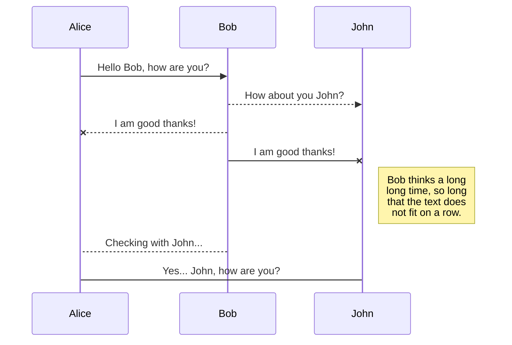

# ABC Swarm algorithm

Rude JS implementation of **ABC (Artificial Bee Colony)** algorithm ->[more info](https://en.wikipedia.org/wiki/Artificial_bee_colony_algorithm)

Provides a rude interface for searching and extracting food sources.
Algorithm is still on development.

For now, new food sources are discovered randomly.
New candidates should be selected based on probability, but for now just the top ones are selected.


## KaTeX

You can render LaTeX mathematical expressions using [KaTeX](https://khan.github.io/KaTeX/):

The *Gamma function* satisfying $\Gamma(n) = (n-1)!\quad\forall n\in\mathbb N$ is via the Euler integral

$$
\Gamma(z) = \int_0^\infty t^{z-1}e^{-t}dt\,.
$$

> You can find more information about **LaTeX** mathematical expressions [here](http://meta.math.stackexchange.com/questions/5020/mathjax-basic-tutorial-and-quick-reference).


## UML diagrams

You can render UML diagrams using [Mermaid](https://mermaidjs.github.io/). For example, this will produce a sequence diagram:



And this will produce a flow chart:

```mermaid
graph LR
A[Square Rect] -- Link text --> B((Circle))
A --> C(Round Rect)
B --> D{Rhombus}
C --> D
```beehive
<!--stackedit_data:
eyJoaXN0b3J5IjpbODQwODQwMDYyLDUwNzgwMDE5MiwtMTU1Mz
A5NTQ1NSwtOTg3NDk3Njk1XX0=
-->